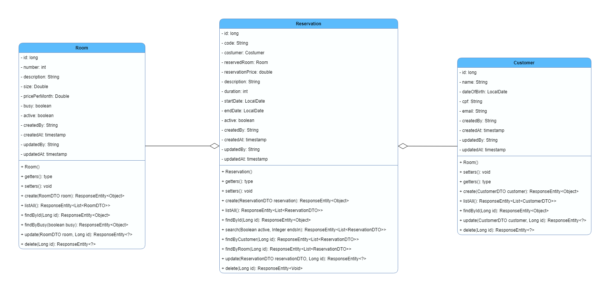

# Reservation Management

Projeto final do módulo de SpringBoot desenvolvido durante o programa de formação +Devs2Blu.

## Requisitos Funcionais

- RF01: O sistema deve conter as entidades Customer, Room e Reservation
- RF02:  Essas entidades devem ter operações de criação, listagem, busca por id, atualização e exclusão.
- RF03: Deve ser possível listar as salas que estão em uso ou livres;
- RF04: Deve ser possível listar as reservas vigentes;
- RF05: Deve ser possível listar as reservas que acabam dentro de determinada quantidade de meses;
- RF06: Deve ser possível listar as reservas de um determinado cliente;
- RF07: Deve ser possível listar as reservas de uma determinada sala.

## Requisitos Não Funcionais

- RNF01: O sistema deve ser desenvolvido utilizando Java;
- RNF02: Utilizar o framework SpringBoot;
- RNF03: A persistência dos dados deve ser utilizando PostgreSQL;
- RNF04: As entidades do sistema devem conter campos de auditoria.

## Regras de Negócio

- RN01: O periódo máximo de uma reserva deve ser de 36 meses;
- RN02: Em reservas de pelo menos 12 meses, haverá desconto de 10%;
- RN03: Deve ser feita uma verificação se a data de início e final tem uma diferença de meses igual a informada no campo de duração, e caso necessário, corrigir;
- RN04: Uma sala só pode ser reservada se estiver livre, e caso seja reservada, deverá ser considerada ocupada;
- RN05: Um cliente não pode ser registrado se tiver menos de 18 anos.

## Documentação via Swagger

 - Disponível em:
> http://localhost:8080/swagger-ui/index.html

> https://reservation-management-production.up.railway.app/swagger-ui/index.html

## Requisições para as APIs do sistema
- [Arquivo Insomnia](docs/Insomnia.json)

### Variáveis de ambiente
 **_environment_develop**: Utilizar quando o sistema estiver sendo executado em localhost  
> http://localhost:8080

 **_environment_production**: Utilizar quando estiver usando o sistema implantado no Railway  
> https://reservation-management-production.up.railway.app
